# SweeperBot

SweeperBot es un robot autónomo diseñado para ayudar en el ámbito medioambiental, y que es el producto final de una idea que garantiza una mayor sostenibilidad del entorno que nos rodea. 
Para llevar a cabo su cometido, el robot se contempla como un vehículo autónomo, de manera que pueda moverse libremente y sin ningún tipo de supervisión para la búsqueda de residuos. Para la recolección de estos, el robot dispone de un brazo mecánico con pinza, esta le permitirá agarrar los desechos y soltarlos en unos compartimentos a modo de reciclaje. 

## Diseño 3D

El proyecto contiene archivos STL para formar la estructura del robot.

### Robot montado

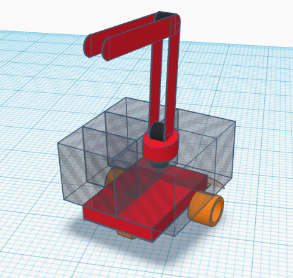

### Pinza

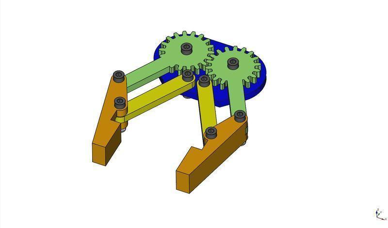

### Articulaciones del brazo

### Base del brazo

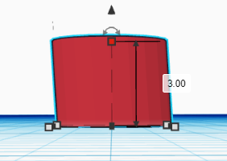

### Base de la carrocería

### Soporte de la caja

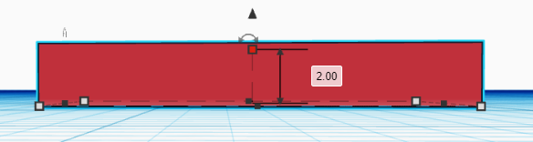

  
### Caja con corpantimentos

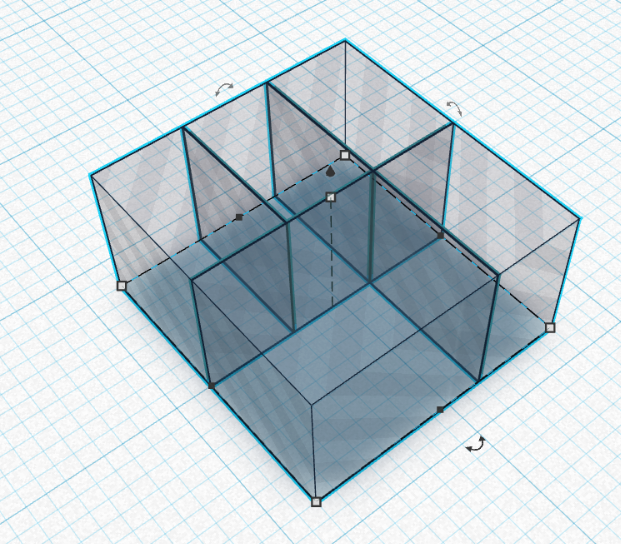

  
## Reconocimiento de objetos
Se ha utilizado el lenguaje Python para realizar el reconocimiento e identificación de formas, y se ha importado la librería “opencv” para obtener imágenes de la cámara. Y la librería “imageai” que utiliza “tensorflow”, una librería orientada a construir y entrenar redes neuronales, para utilizar un modelo de reconocimiento de objetos (Yolo).

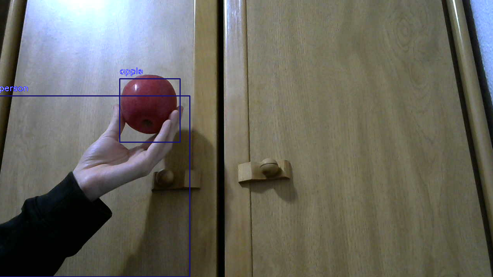

Tras unas adaptaciones se ha utilizado el modelo para reconocer objetos en una simulación en CoppeliaSim.

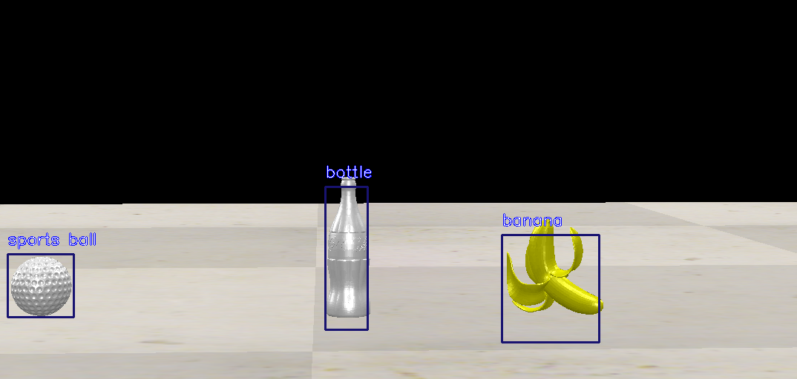

Los datos de cada objeto se gestionan con Python como una lista de diccionarios.

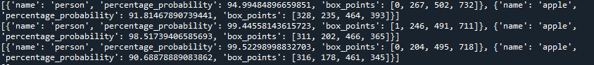

## Simulación

Se ha simulado el comportamiento del robot con CoppeliaSim para recrear un espacio con una serie de diferentes objetos, que se interponen en el camino del robot. Éste, pudiendo detectarlos, recogerlos y almacenarlos en los compartimentos correspondientes, simula su correspondiente actuación. 

### Ruedas
Se han utilizado las siguientes ruedas para la simulación.

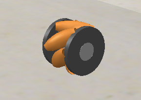
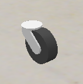

### Ruedas incorporadas en el stl de la caja

  
### Funcionamiento

El robot gira hasta detectar un objeto que le interesa.

Una vez detectado se acerca a el, lo recoge y lo almacena en el compartimento que le pertoque.

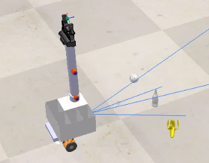
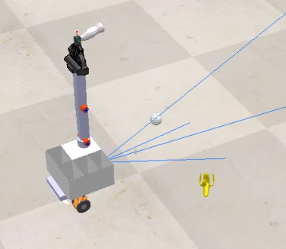

  Mas información en el documento: RLP_SPRINT_5_Grupo13.pdf

